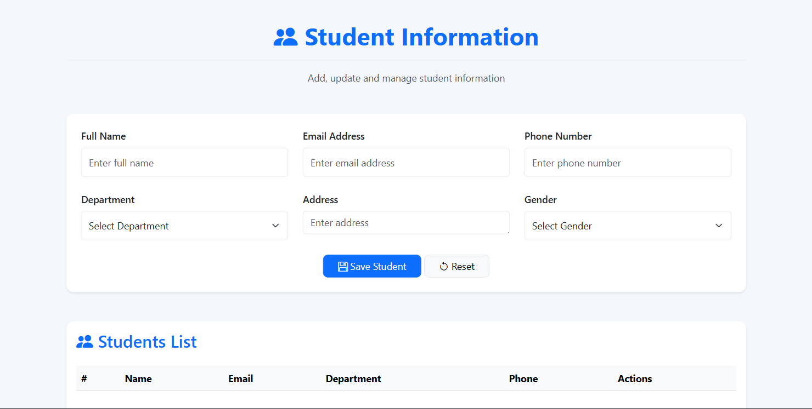
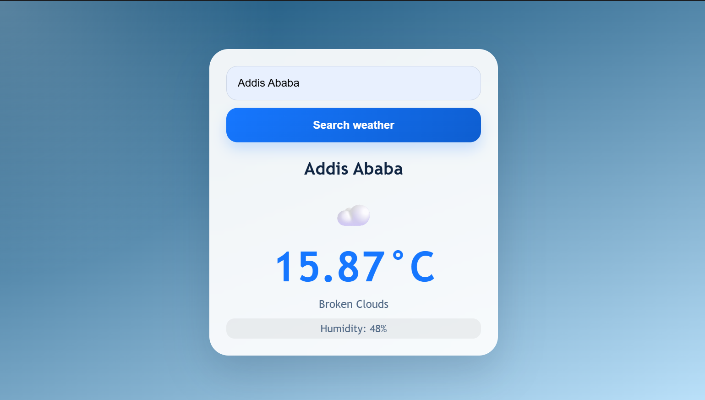
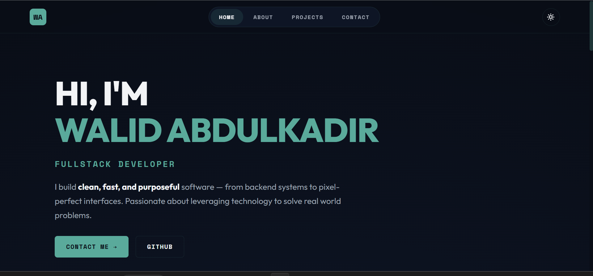

<h1 align="center">Hi 👋, I'm Walid Abdulkadir</h1>

<h3 align="center">
Computer Science Student • Full-Stack Developer • Problem Solver
</h3>

Passionate about building modern web applications, solving real-world problems, and continuously learning new technologies.

---

## 🚀 About Me

- 🎓 Computer Science Student
- 💻 Full-Stack Developer
- 🌱 Currently learning React, Node.js, Express.js, MongoDB
- 🔭 Building real-world software projects
- ⚡ Interested in Software Engineering, Web Development, and AI
- 📍 Addis Ababa, Ethiopia

---

## 🛠️ Tech Stack

### Frontend

### Backend

### Database

### Tools

---

# 📌 Featured Projects

## 🎓 Student Management System

Full-stack web application for managing students.

### Features

- Student Registration
- CRUD Operations
  
### Features Update
- Search & Filter
- Attendance Tracking
- Grade Management

### Screenshot

### Links

📂 Repository:[ https://github.com/walidabdulkadir/student-management-system](https://github.com/walidabdulkadir/Student-Managment-System)

---

## 🌤️ Weather App

Real-time weather dashboard using Weather APIs.

### Features

- Current Weather
- Forecast Data
- Search by City
- Responsive Design

### Screenshot

### Links

📂 Repository: [https://github.com/walidabdulkadir/weather-app](https://github.com/walidabdulkadir/weather_app)

---

## 💼 Portfolio Website

Personal portfolio showcasing skills, projects, and achievements.

### Features

- Responsive UI
- Projects Showcase
- Resume Download
- Contact Form

### Screenshot

### Links

🔗 Live Demo: [https://walid-abdulkadir-portfolio.vercel.app/](https://walid-abdulkadir-portfolio.vercel.app/)

📂 Repository: [https://github.com/walidabdulkadir/portfolio](https://github.com/walidabdulkadir/My-portfolio)

---

# 📊 GitHub Statistics

---

# 🔥 GitHub Streak

---

# 📈 Contribution Graph

---

## 🐍 Contribution Snake

# 🤝 Connect With Me

---

## 💡 Quote

> "Every expert was once a beginner who refused to quit."
